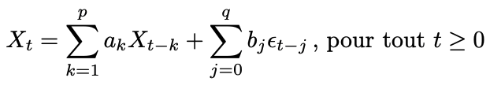

# Partie 1: Simulation de processus ARMA

### 1) Donner la définition d'un processus ARMA(p, q), Quelles sont les conditions sur les coefficients pour que ce processus soit stationnaire?

=> ARMA: Modèles autorégressifs et moyenne mobile d'ordre p,q est défini par:  
  
  
Pour que ce processus X_t soit stationnaire du second ordre (faiblement stationnaire) si pour X_t et t appartenant à T on a sa variance, sa moyenne et sa covariance qui sont indépendantes du temps. C'est-à-dire d'avoir une espérance constante, une variance constante finie.
  
Il faut que:  
    1. a_p != 0 et b_q !=0  
    2. a et b ne doivent pas avoir de racines communes et de modules > 1  
    3. epsilon doit être un bruit blanc de variance sigma^2
    
### 2) En utilisant la fonction R arima.sim, simuler plusieurs processus AR_p et MA_q (p et q d’un faible ordre de grandeur, c'est-à-dire [1,10[). Rappeler la formule mathématique des processus à simuler et vérifier que le choix de p et q respecte les conditions de stationnarité.

```{r}
#ts.sim <- arima.sim(n = 2, list(ar = c(0.8897, -0.4858), ma = c(-0.2279, 0.2488)), sd = sqrt(0.2))
ts.sim <- arima.sim(n=200, list(order = c(1,1,0), ar = c(0.7, 0.5),  ma=c(0.2, 0.3)), sd=sqrt(0.2))
ts.plot(ts.sim)
```


### 3) Observer les auto-corrélations empiriques. Que constatez-vous?

### 4) Simuler plusieurs ARMAp,q. Observer et interpréter les auto-corrélations empiriques.


# Partie II : Analyse des précipitations mensuelles à San Francisco Charger les données depuis le fichier sanfran.dat, disponible sur le moodle.

## 1)
### a) La série temporelle est-elle stationnaire? Si non, la modifier pour qu’elle le devienne et sauvegarder cette série temporelle dans une nouvelle variable.

### b) Proposer un modèle AR_p ou AM_q adapté sur ces données. Valider la modélisation en testant les résidus.

### 2) En utilisant les données d’origine de 1932 à 1963, tester un modèle AR_2 avec une composante saisonnière, c’est-à-dire un modèle SARIMA_2,0,0,12.

### 3) Calculer et afficher les résidus du modèle SARIMA_2,0,0,12.

### 4) Utiliser le modèle précédent pour prédire les précipitations mensuelles de 1964, 1965 et 1966. Superposer sur un graphique les prédictions et les valeurs réelles.

### 5) Faire de même pour le modèle AR_2 proposé dans la partie 1), sur les données correspondantes.

### 6) Quel est le meilleur modèle de prédiction, graphiquement?

### 7) Comment valider, objectivement, la réponse précédente? Mettre en place ces tests et comparer les résultats à ceux obtenus graphiquement.


  