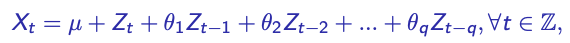

# Partie 1: Simulation de processus ARMA

### 1) Donner la définition d'un processus ARMA(p, q), Quelles sont les conditions sur les coefficients pour que ce processus soit stationnaire?

=> ARMA: Modèles autorégressifs et moyenne mobile d'ordre p,q est défini par:  
  
  
Pour que ce processus X_t soit stationnaire du second ordre (faiblement stationnaire) si pour X_t et t appartenant à T on a sa variance, sa moyenne et sa covariance qui sont indépendantes du temps. C'est-à-dire d'avoir une espérance constante, une variance constante finie.
  
Il faut que:  
    1. a_p != 0 et b_q !=0  
    2. a et b ne doivent pas avoir de racines communes et de modules > 1  
    3. epsilon doit être un bruit blanc de variance sigma^2 (est un processus stationnaire)

De ce fait pour avoir un processus stationnaire, il faut que les coefficients composée par le calcul des AR et MA soient inférieur strictement à 1 en valeur absolue.  
Un processus MA(q) est toujours stationnaire.
    
### 2) En utilisant la fonction R arima.sim, simuler plusieurs processus AR_p et MA_q (p et q d’un faible ordre de grandeur, c'est-à-dire [1,10[). Rappeler la formule mathématique des processus à simuler et vérifier que le choix de p et q respecte les conditions de stationnarité.


#### Simulation d'un processus AR(p)

=> AR(p): Processus autorégressif d'ordre p


Simulons un processus AR(4) par exemple : X_t = 0.9X_t-1 - 0.5X_t-2 + 0.4X_t-3 - 0.2X_t-4

```{r}
ts_ar.sim <- arima.sim(n = 100, list(ar = c(0.9, -0.5, 0.4, -0.2)))
ts.plot(ts_ar.sim)
```
 
Nous avons bien tous nos coefficients a_i pour AR inférieur strictement à 1 en valeur absolue.


#### Simulation d'un processus MA(q)

=> MA(q): Processus moyenne mobile d'ordre q


Simulons un processus MA(4) par exemple : X_t = 0.7Z_t-1 - 0.6Z_t-2 - 0.4Z_t-3 + 0.7Z_t-4

```{r}
ts_ma.sim <- arima.sim(n = 100, list(ma = c(0.7, -0.6, -0.4, 0.7)))
ts.plot(ts_ma.sim)
```

Nous avons bien tous nos coefficients b_i pour MA inférieur strictement à 1 en valeur absolue.


### 3) Observer les auto-corrélations empiriques. Que constatez-vous?

```{r}
acf_ar <- acf(ts_ar.sim, type=('correlation'))
```

Pour l'autocorrélation empirique du processus AR semble particulièrement forte pour les décalages 1, 2 et 3.  
0 étant une auto-corrélation avec lui-même d'où la valeur de 1.0 maximale. L'autocorrélation empirique semble être périodique. Les décalages 5, 6, 7 et 8 ont une corrélation plus faible voir nulle.  


```{r}
acf_ma <- acf(ts_ma.sim, type=('correlation'))
```
Pour l'autocorrélation empirique du processus MA semble être très peu corrélée à pour chaque décalage.L'autocorrélation empirique semble être périodique. 


La période d'autocorrélation empirique du processus AR donnée par le décalage est plus grande que la période d'autocorrélation empirique du processus MA. 


### 4) Simuler plusieurs ARMAp,q. Observer et interpréter les auto-corrélations empiriques.

```{r}
ts_arma1.sim <- arima.sim(n = 100, list(ar = c(0.9, -0.5, 0.4, -0.2), ma = c(0.7, -0.6, -0.4, 0.7)))
ts.plot(ts_arma1.sim)

ts_arma2.sim <- arima.sim(n = 100, list(ar = c(0.5, 0.4, -0.8), ma = c(0.4, -0.9, -0.7)))
ts.plot(ts_arma2.sim)
```

```{r}
acf_arma1 <- acf(ts_arma1.sim, type=('correlation'))
acf_arma2 <- acf(ts_arma2.sim, type=('correlation'))
```

Pour l'ARMA1, on observe une faible corrélation empirique à partir du 5 eme décalage. 
0 étant une auto-corrélation avec lui-même d'où la valeur de 1.0 maximale.

Pour l'ARMA2, on observe une faible corrélation empirique aux retards 2, 6, 10, 11 et 18.
0 étant une auto-corrélation avec lui-même d'où la valeur de 1.0 maximale.

# Partie II : Analyse des précipitations mensuelles à San Francisco Charger les données depuis le fichier sanfran.dat, disponible sur le moodle.

```{r}
library("rio")
data<-import('./sanfran.dat', header=FALSE)
data_list <- split(data, seq(nrow(data)))
```

```{r}
library('data.table')
length(data_list)
data_reformat <- c()

for(i in 1:length(data_list)) {
  for(j in 1:6) {
    data_reformat[(i-1)*6+j] <- as.double(data_list[[i]][j])
  }
}
```

## 1)
### a) La série temporelle est-elle stationnaire? Si non, la modifier pour qu’elle le devienne et sauvegarder cette série temporelle dans une nouvelle variable.

```{r}
data_ts <-ts(data_reformat, start=c(1932,1), end=c(1966,12), frequency=12)
data_ts_statio <- diff(data_ts)
ts.plot(data_ts_statio)
```

Afin d'éliminer la saisonnalité, j'ai choisi d'utiliser le lissage par moyenne mobile d'ordre 12 car sur le graphique, les phases de croissance et de baisse semblent se renouveller chaque année avec une certaine régularité. 

```{r}
# filtre par moyenne arithmétique d'ordre 12 de la série pour obtenir la tendance
#data_ts_statio<-stats::filter(data_ts, c(1/22, rep(1/11, 12), 1/22), sides=2) 
#data_ts_statio<-ts(data_ts_statio, start=c(1963,1), end=c(1993,12), frequency=12)
#ts.plot(data_ts_statio) 
```

### b) Proposer un modèle AR_p ou AM_q adapté sur ces données. Valider la modélisation en testant les résidus.

Afin de déterminer le modèle AR(p), MA(q) ou ARMA(p,q) nous pouvons analyser l'autocorrélation et l'autocorrélation partielle. 

Si au retard p nous avons une autocorrélation (ACF) et pas d'autocorrélation partielle (PACF) alors nous devrions choisir d'implémenter le modèle AR(p)

Si au retard q nous avons une autocorrélation partielle (PACF) et pas d'autocorrélation (ACF) alors nous devrions choisir d'implémenter le modèle MA(q)

Si l'autocorrélation (ACF) et l'autocorrélation partielle (PACF) semblent "se suivre" alors nous devrions choisir d'implémenter le modèle ARMA(p,q)


```{r}
# ACF: corrélation entre une observation avec la valeur du retard
acf(data_ts_statio)
```


```{r}
# PACF: corrélation d'une observation qui n'est pas prise en compte par l'observation antérieure décalée (autocorrélation partielle)
pacf(data_ts_statio)
```


Proposition d'un modèle MA(q) adapté sur ces données. 

```{r}
ts_sanfran_ma.sim <- arima.sim(n = 420, list(ma = data_ts_statio))
ts.plot(ts_sanfran_ma.sim)
acf(ts_sanfran_ma.sim)
```

Validation de la modélisation en testant les résidus : 

```{r}
S <- (data_ts - (round(data_ts_statio, 2)))
s<-tapply(S,cycle(S),mean,na.rm=T)

s<-s-mean(s)
CVS<-matrix(1, 35, 12)
for(i in 1:35){
  for(j in 1:12){
    CVS[i,j]=t(matrix(data_ts,12,35))[i,j]-s[j]
  }
}
# Nous avons 35 ans de données sur 12 mois
```


```{r}
CVS=as.vector(t(CVS)) #convert to vector
CVS=as.ts(CVS) #convert into time series
CVS=ts(CVS, start=c(1932, 1), end=c(1966, 12), frequency=12)
ts.plot(CVS)
```

```{r}
y=time(CVS) #count nb of values
z=time(CVS)^2
CVS.lm=lm(CVS~y+z)
res=CVS-CVS.lm$fitted.values
res=res/sqrt(var(res))
acf(res)
```

### 2) En utilisant les données d’origine de 1932 à 1963, tester un modèle AR_2 avec une composante saisonnière, c’est-à-dire un modèle SARIMA_2,0,0,12.

```{r}
data_ts_1932_1963 <- window(data_ts_statio, c(1932, 1), c(1963,12))
model<-arima(data_ts_1932_1963, order=c(2,0,0), list(order=c(2,0,0), period=12)); model
```


### 3) Calculer et afficher les résidus du modèle SARIMA_2,0,0,12.

```{r}
Box.test(model$residuals)
```


```{r}
qqnorm(model$residuals) 
```

### 4) Utiliser le modèle précédent pour prédire les précipitations mensuelles de 1964, 1965 et 1966. Superposer sur un graphique les prédictions et les valeurs réelles.

```{r}

```

### 5) Faire de même pour le modèle AR_2 proposé dans la partie 1), sur les données correspondantes.

```{r}

```

### 6) Quel est le meilleur modèle de prédiction, graphiquement?

```{r}

```

### 7) Comment valider, objectivement, la réponse précédente? Mettre en place ces tests et comparer les résultats à ceux obtenus graphiquement.

```{r}

```


  